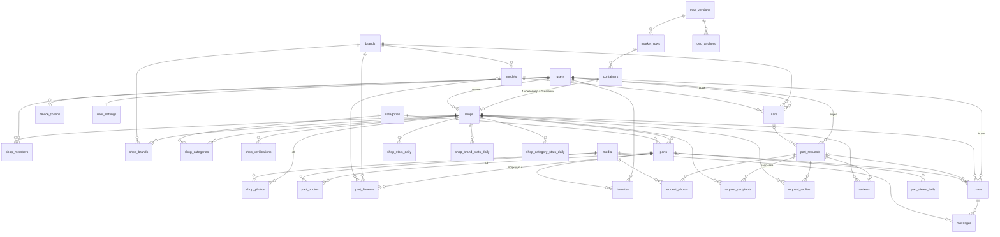

# Кудайберген — бэкенд v2: схема БД и API по экранам

Статус: **черновик на согласование** (до «ок» код не пишем).
Источники: ТЗ v2 (модули auth…map-filter), дополнение про карту/QR/админку, макет `kudaibergen-design-handoff-v2` (31 экран, `market-map.json`, `brands.json`).

Стек: Java 21 · Spring Boot 3.3 · PostgreSQL 16 (+ `pg_trgm`, `unaccent`) · Redis 7 · Kafka · MinIO · Flyway · Spring Security + JWT · Centrifugo (чат, как в v1) · springdoc · Testcontainers.

---

## 0. Сквозные решения

| Тема | Решение |
|---|---|
| ID | `BIGINT` identity (как в текущем коде). Наружу — числа. |
| Время | `TIMESTAMPTZ`, в API — ISO-8601 UTC. Часы работы бокса — `TIME` в зоне `Asia/Bishkek`. |
| Деньги | `INT`, сомы, без копеек. `CHECK (price >= 0)`. |
| Телефон | E.164, только `+996XXXXXXXXX` (`^\+996\d{9}$`). |
| Роль | `users.role` = **текущий режим** (BUYER/SELLER); администратор — отдельный флаг `users.is_admin`. Право действовать как продавец = членство в `shop_members`. Экраны 19 «Я продавец — открыть бокс» и 21 «Перейти в режим покупателя» переключают режим без нового аккаунта. |
| Фото | Везде ссылки на `media.id`; URL (320/1080) собирает сервер. |
| Ошибки | `application/problem+json` (RFC 7807) через Spring `ProblemDetail` + расширения `code` (машинный код, как сейчас) и `errors[]` для валидации. |
| Пагинация | Курсор: `?cursor=<opaque>&limit=20` → `{items, nextCursor}`. Курсор = base64(`sortKey,id`). |
| Идемпотентность | Заголовок `Idempotency-Key` на `POST /requests`, `/replies`, `/messages`, `/parts` (механизм уже есть). |
| Язык | `Accept-Language: ru|ky` (в API язык — `RU`/`KG`, как переключатель в макете) (по умолчанию `users.lang`). Справочники отдаются на языке запроса. |
| События | Транзакционный outbox → Kafka (`event_outbox` + publisher). Консьюмеры: notifications, stats. |
| Realtime | Чат остаётся как в v1: Centrifugo (connection-токен с бэкенда, публикация через Server API), фото/голосовые/видео. См. раздел 6. |

---

## 1. ER-диаграмма

---

## 2. Таблицы

### auth / users

**users** — `id`, `phone` UNIQUE, `name`, `avatar_media_id` → media, `role` (BUYER/SELLER), `lang` (RU/KG), `is_admin`, `is_blocked`, `onboarded_at`, `last_seen_at`, `created_at`, `updated_at`.

**user_settings** — `user_id` PK, `notify_replies` bool, `notify_chat` bool, `new_request_sound` bool, `theme` (LIGHT/DARK/SYSTEM).

**device_tokens** — `id`, `user_id`, `token` UNIQUE, `platform` (IOS/ANDROID), `lang`, `updated_at`.

**refresh_tokens** — `id`, `user_id`, `token_hash` UNIQUE, `expires_at`, `revoked_at` (нужно для «Выйти» и ротации).

OTP не в БД, а в **Redis**:

| Ключ | TTL | Содержимое |
|---|---|---|
| `otp:{phone}` | 120 с | `{hash, attempts}`; при 5 неверных — удаляется |
| `otp:cooldown:{phone}` | 42 с | повторная отправка запрещена |
| `rl:otp:phone:{phone}` / `rl:otp:ip:{ip}` | 1 ч | счётчики (напр. 5/ч на номер, 20/ч на IP) |
| `rl:req:{userId}` | 1 ч | лимит создания запросов (напр. 10/ч) |

### garage

**brands** — `id`, `slug` UNIQUE, `name`, `logo_url`, `placeholder`, `color`, `popular`, `sort_order`. Сид: 18 марок из `brands.json`.

**models** — `id`, `brand_id`, `name` («Camry»), `generation` («XV50» / «50»), `year_from`, `year_to`; UNIQUE (`brand_id`, `name`, `generation`). Сид: популярные модели (Camry 30/40/50/70, Prius 20/30, RX, ES, Fit, W204/W211/W212/W221/ML W164/Sprinter/Vito, …).

**cars** — `id`, `user_id`, `brand_id`, `model_id`, `generation`, `year`, `engine` («2.5 бензин», экран 04), `is_primary`, `created_at`. Частичный UNIQUE (`user_id`) WHERE `is_primary`.

### market

**map_versions** — `id`, `version` INT UNIQUE, `is_current` (частичный UNIQUE), `boundary` JSONB, `blocks` JSONB (СТО, админ., безымянные), `passages` JSONB, `entrances` JSONB, `pois` JSONB (парковка, туалет), `geo_affine` JSONB (матрица 2×3 GPS→xy), `published_at`. Сид v1 = `market-map.json`.

**market_rows** — `id`, `map_version_id`, `code` («14», «Ю», «Жайма 3»), `type` (ROW/VROW/STALL), `geometry` JSONB (`{rect:{x,y,w,h}}` или `{polygon:[[x,y]…]}` — ряды А и З), `north_count`, `south_count`, `sort_order`, `qr_token` UNIQUE.

**containers** — `id`, `row_id`, `number`, `side` (NORTH/SOUTH — для вертикальных рядов трактуем как WEST/EAST, храним тем же enum), `pos_in_row`, `qr_token` UNIQUE, `tenant_phone` (номер от администрации для SMS-проверки), `is_active`. UNIQUE (`row_id`, `side`, `number`). Геометрия не хранится — считается из прямоугольника ряда.

**geo_anchors** — `id`, `map_version_id`, `lat`, `lon`, `x`, `y`, `label`. По 3–4 точкам МНК считаем `geo_affine`.

Граф проходов строится в памяти из `map_versions.passages` при старте/публикации версии и кешируется.

### shops

**shops** — `id`, `owner_id`, `name`, `avatar_media_id`, `container_id`, `pending_container_id` (переезд), `status` (PENDING_VERIFICATION / ACTIVE / REJECTED / SUSPENDED), `verified_at`, `open_from`, `open_to` (TIME), `is_open` (ручной тумблер «Бокс открыт/закрыт»), `phone`, `rating` NUMERIC(2,1), `reviews_count`, `created_at`, `updated_at`.
- UNIQUE (`container_id`) WHERE `status` IN ('PENDING_VERIFICATION','ACTIVE','SUSPENDED') — один контейнер = один магазин; отклонённые контейнер не держат.
- Покупателям и в рассылке — только `ACTIVE`.

**shop_members** — (`shop_id`, `user_id`) PK, `role` (OWNER/SELLER), `created_at`. «Продавцы в боксе» (21).

**shop_photos** — `id`, `shop_id`, `media_id`, `is_cover`, `sort`. ≤8 (проверка в сервисе + триггер), частичный UNIQUE (`shop_id`) WHERE `is_cover`.

**shop_brands** — (`shop_id`, `brand_id`) PK; индекс (`brand_id`, `shop_id`).

**shop_categories** — (`shop_id`, `category_id`) PK; индекс (`category_id`).

**shop_verifications** — `id`, `shop_id`, `container_id`, `method` (QR/ADMIN/SMS), `status` (PENDING/APPROVED/REJECTED), `lat`, `lon`, `distance_m`, `decided_by`, `reason`, `created_at`, `decided_at`. SMS-код проверки — в Redis `shopverify:{shopId}`.

**favorite_shops** — (`user_id`, `shop_id`) PK (экран 19 «Избранные магазины»).

### media

**media** — `id`, `owner_id`, `purpose` (AVATAR/SHOP/PART/REQUEST/REPLY/CHAT), `bucket`, `object_key`, `content_type`, `size_bytes`, `width`, `height`, `status` (PENDING/READY/FAILED), `variants` JSONB (`{"320": key, "1080": key}`), `created_at`. Неподтверждённые PENDING старше 24 ч чистит джоба.

### catalog

**categories** — `id`, `slug`, `name_ru`, `name_ky`, `sort_order`. Сид: Ходовая, Тормоза, Двигатель, Оптика, Кузов, Электрика, Охлаждение, Трансмиссия, Салон, Фильтры и ТО.

**parts** — `id`, `shop_id`, `title`, `category_id`, `condition` (NEW/USED/ON_ORDER), `price` INT, `quantity` INT, `oem_number`, `oem_norm` (без пробелов/дефисов, UPPER), `status` (DRAFT/ACTIVE/OUT_OF_STOCK/ARCHIVED — DRAFT из-за кнопки «Черновик» на 26), `views_count`, `search_tsv` tsvector (generated: `russian`(title) ‖ `simple`(title) ‖ `simple`(oem_norm)), `created_at`, `updated_at`.

**part_photos** — `id`, `part_id`, `media_id`, `is_main`, `sort`. ≤6.

**part_fitments** — `id`, `part_id`, `brand_id`, `model_id` NULL, `year_from` NULL, `year_to` NULL.

**favorites** — (`user_id`, `part_id`) PK, `created_at`.

### requests

**part_requests** — `id`, `buyer_id`, `car_id` NULL, снимок машины `brand_id`, `model_id`, `year` (машину могут удалить из гаража), `text`, `category_id` NULL (если выбран чип «+ Колодки»), `target` (MARKET/ROWS/CONTAINERS), `target_row_ids` BIGINT[] (1–10), `target_container_ids` BIGINT[] (1–30), `status` (ACTIVE/EXPIRED/CLOSED), `duration` (MIN_30/HOUR_1/HOUR_3/END_OF_DAY), `sent_at` (начало текущего окна ожидания), `expires_at`, `extended_times` (≤3), `closed_with_shop_id`, `closed_at`, `recipients_count`, `have_count`, `created_at`. END_OF_DAY — до 17:00 по Бишкеку, если уже позже — 3 часа. Раз в минуту активные с `expires_at` в прошлом становятся EXPIRED; покупатель продлевает (`extend`) или расширяет до всего рынка (`widen`) — запрос снова ACTIVE.

**request_photos** — (`request_id`, `sort`) PK, `media_id`. ≤3.

**request_recipients** — (`request_id`, `shop_id`) PK, `row_id`, `container_id` (место на момент рассылки), `status` (DELIVERED/SEEN/HAVE/NOT_HAVE/EXPIRED), `notified_at`, `seen_at`, `replied_at`. Нужна для ленты продавца (11, фильтр «Истёкшие»), статистики запроса (32) и статистики «без ответа» (17). MARKET и ROWS уходят магазинам с маркой машины, CONTAINERS — выбранным боксам без фильтра по марке.

**request_replies** — `id`, `request_id`, `shop_id`, `answer` (HAVE/NOT_HAVE), `condition` NULL, `message`, `price` NULL, `created_at`; UNIQUE (`request_id`, `shop_id`).

**reply_photos** — (`reply_id`, `sort`) PK, `media_id`. ≤3, только у «Есть».

**reviews** — `id`, `shop_id`, `buyer_id`, `request_id` UNIQUE, `stars` 1–5, `tags` TEXT[] (FAST_REPLY / PART_OK / EASY_TO_FIND), `created_at`. Рейтинг пересчитывается в той же транзакции.

### chat

**chats** — `id`, `buyer_id`, `shop_id`, `request_id` NULL, `part_id` NULL, `last_message_id`, `last_message_at`, `buyer_unread` INT, `shop_unread` INT, `created_at`. UNIQUE (`buyer_id`, `shop_id`, `request_id`) + частичный UNIQUE (`buyer_id`, `shop_id`) WHERE `request_id` IS NULL.

**messages** — `id`, `chat_id`, `sender_id`, `text`, `media_id` NULL, `quick_reply` NULL (RESERVED «Отложил для вас» / DIRECTIONS «Как пройти» / SOLD «Продано»), `created_at`, `read_at`.

### notifications / events

**event_outbox** — `id` UUID, `topic`, `key`, `payload` JSONB, `created_at`, `published_at`.
**processed_events** — (`consumer`, `event_id`) PK — дедупликация в консьюмерах.

Kafka-топики: `request.created`, `request.reply.created`, `request.closed`, `request.expired`, `chat.message.created`, `part.viewed`, `shop.status.changed`.

Шаблоны пушей RU/KY — `messages_ru/ky.properties`, не в БД.

### stats (агрегаты из событий)

**shop_stats_daily** — (`shop_id`, `day`) PK: `requests_received`, `replied_have`, `replied_not_have`, `chats_started`, `sales`, `unanswered_while_open`, `response_time_sum_s`, `response_count`, `part_views`.
**shop_brand_stats_daily** — (`shop_id`, `day`, `brand_id`) PK, `requests`.
**shop_category_stats_daily** — (`shop_id`, `day`, `category_id`) PK, `requests`.
**part_views_daily** — (`part_id`, `day`) PK, `views`. Дедуп просмотров: Redis `pv:{partId}:{userId}` TTL 1 ч.

### Ключевые индексы

| Для чего | Индекс |
|---|---|
| Рассылка запроса | `shop_brands(brand_id, shop_id)`; `shops(status, is_open)` WHERE status='ACTIVE'; `containers(row_id)`; `shops(container_id)` |
| Поиск | GIN `parts(search_tsv)`; GIN trgm `parts(title)`, `parts(oem_norm)`; `parts(status, category_id, price, id)`; `parts(status, created_at DESC, id)`; `part_fitments(brand_id, model_id)`; `part_fitments(part_id)` |
| Мои запчасти | `parts(shop_id, status, created_at DESC)` |
| Лента продавца | `request_recipients(shop_id, notified_at DESC)` |
| Мои запросы | `part_requests(buyer_id, created_at DESC)`; `part_requests(expires_at)` WHERE status='ACTIVE' (таймер истечения) |
| Чаты | `chats(buyer_id, last_message_at DESC)`, `chats(shop_id, last_message_at DESC)`, `messages(chat_id, id DESC)` |

---

## 3. Экран → эндпоинты → DTO

Все пути под `/api/v1`. 🔒 — нужен JWT; 🛒 — режим покупателя; 🏪 — член магазина; 🛡 — ADMIN.

Общие DTO:
- `CarDto {id, brand: BrandShortDto, model: {id,name,generation}, year, engine, isPrimary, label:"Camry 50 · 2012"}`
- `BrandShortDto {id, slug, name, logoUrl, placeholder, color}`
- `LocationDto {rowId, rowCode, containerId, containerNumber, side}` — «Ряд 14 · Бокс 12 · северная»
- `ShopCardDto {id, name, avatarUrl, rating, reviewsCount, location: LocationDto, isOpenNow, openTo, opensAt}`
- `PhotoDto {mediaId, thumbUrl(320), url(1080)}`
- `Problem {type, title, status, detail, instance, code, errors?[{field,message}]}`

### Вход

| Экран | Эндпоинты | DTO |
|---|---|---|
| 01 Номер | `POST /auth/otp/send` | → `{phone, lang}` ← `{expiresIn:120, resendIn:42, debugCode?}`; 429 `OTP_COOLDOWN`/`OTP_RATE_LIMITED` (+`retryAfter`, заголовок `Retry-After`) |
| 02 Код | `POST /auth/otp/verify`, повтор — `POST /auth/otp/send` | → `{phone, code, lang?}` ← `TokenDto {accessToken, refreshToken, expiresIn, isNewUser, user: MeDto}`; 400 `OTP_INVALID {attemptsLeft}`, 400 `OTP_EXPIRED`, 400 `OTP_ATTEMPTS_EXCEEDED` |
| — | `POST /auth/refresh`, `POST /auth/logout` 🔒 | `{refreshToken}` |
| 03 Роль | `PUT /me/role` 🔒 | → `{role: BUYER\|SELLER}` ← `MeDto {id, phone, name, avatarUrl, role, lang, hasShop, shopStatus?, counters:{cars, requests, favoriteShops}}` |

### Покупатель

| Экран | Эндпоинты | DTO |
|---|---|---|
| 04 Гараж | `GET /me/cars`, `POST /me/cars`, `PATCH /me/cars/{id}`, `DELETE /me/cars/{id}`, `POST /me/cars/{id}/primary`; справочник `GET /brands?q=&popular=`, `GET /brands/{id}/models` | `CreateCarDto {brandId, modelId, generation?, year, engine?}` ← `CarDto`; `ModelDto {id, name, generation, yearFrom, yearTo}` |
| 05 Главная | `GET /me`, `GET /requests/my?status=&cursor=`, `GET /me/badges` | `RequestSummaryDto {id, text, carLabel, state: WAITING\|HAS_ANSWERS\|NO_ANSWERS\|CLOSED, haveCount, createdAt}`; `BadgesDto {unreadChats}` |
| 06, 06б, 31 Найти запчасть | `GET /me/cars`; `GET /categories?suggest=true` (чипы); `POST /media/photos?purpose=REQUEST` (фото); `GET /market/rows` (Рядам, Контейнерам); `GET /requests/estimate?carId=&brandId=&target=&rowIds=&containerIds=` (живой счётчик); `POST /requests` | ← `{recipients:18, brand:"Toyota"}`; `CreateRequest {carId, text, categoryId?, target: MARKET\|ROWS\|CONTAINERS, targetRowIds[]?, targetContainerIds[]?, duration?, mediaIds[]≤3}` ← `RequestDetailDto` |
| 07 Ответы | `GET /requests/{id}`, `GET /requests/{id}/replies`; «Написать» → `POST /chats` | `RequestDetailDto {id, text, car, photos[], target, status, state, recipientsCount, seenCount, haveCount, createdAt}`; `ReplyDto {id, shop: ShopCardDto, condition, message, price, photos[], createdAt}` (только HAVE) |
| 08 Чат | `GET /chats/{id}`, `GET /chats/{id}/messages?cursor=`, `POST /chats/{id}/messages`, `POST /chats/{id}/read`; STOMP `SUBSCRIBE /topic/chats/{id}`; «Как пройти» → 18; «Купил — закрыть» → 09 | `ChatDto {id, shop: ShopCardDto, buyer:{id,name,avatarUrl}, request?:{id,text,carLabel,status}, part?:{id,title,price,photo}, online}`; `SendMessageDto {text?, mediaId?, quickReply?, clientId}` ← `MessageDto {id, chatId, senderId, text, photo?, quickReply, createdAt, readAt}` |
| 09 Закрыт | `POST /requests/{id}/close`; `GET /reviews/tags` | → `{shopId?, stars?, tags[]}` ← `RequestDetailDto`; `ReviewTagDto {code, label}` |
| 27 Каталог | `GET /parts/search` | query: `q, carId \| brandId+modelId+year, categoryId, condition, priceMin, priceMax, inStock, sort=PRICE_ASC\|PRICE_DESC\|NEWEST\|NEAREST, x, y, cursor, limit` ← `{items: PartCardDto[], total, nextCursor}`; `PartCardDto {id, title, price, photo: PhotoDto, fits, condition, inStock, isFavorite, shop:{id, name, avatarUrl, rowCode, containerNumber}}` |
| 28 Марка авто | `GET /brands?popular=true`, `GET /brands?q=`, `GET /brands/{id}/models`, `GET /parts/search/count?…` («Показать 86»), `POST /me/cars` | `{count}` |
| 29 Карточка | `GET /parts/{id}?carId=`, `PUT/DELETE /parts/{id}/favorite`, «Написать» → `POST /chats`, «Как пройти» → `GET /market/route` | `PartDetailDto {id, title, price, photos[], condition, quantity, status, oemNumber, category, fitments[{brand, model?, yearFrom?, yearTo?, label}], fits, fitsCarLabel, isFavorite, shop: ShopCardDto + coverPhoto}` |
| 30 Профиль продавца | `GET /shops/{id}`, `GET /shops/{id}/parts?carId=&cursor=`, `GET /shops/{id}/photos`, `GET /shops/{id}/reviews?cursor=`, `PUT/DELETE /shops/{id}/favorite` | `ShopPublicDto {… ShopCardDto, phone, photos[], brands: BrandShortDto[], counts:{parts, photos, reviews}, isFavorite}`; `ReviewDto {id, stars, tags[], buyerName, createdAt}` |
| 15 Рынок | `GET /market/map` (ETag/`If-None-Match`, версия); `GET /market/map/highlight?kind=BRAND\|CATEGORY&id=&fromX=&fromY=\|fromLat=&fromLon=\|fromEntrance=`; `GET /market/search?q=` (строка «Ряд, бокс или магазин»); `POST /market/locate`; `GET /market/qr/{token}`; «Списком» → `GET /shops?brandId=&categoryId=` | `MapDto {version, boundary, rows:[{id, code, type, geometry, northCount, southCount}], blocks[], passages[], entrances[], pois[], geoAffine}`; `MapHighlightDto {kind, id, name, rowIds[], containerIds[], shopsCount, rowsCount, openNowCount, nearestRowId, nearestRow, nearestContainerId, nearestContainer, nearestShopId, nearestDistanceM, nearestMinutes, fromSource}`; `LocateDto → {lat, lon, accuracyM}` ← `{x, y, radius}`; `QrResolveDto {type: ROW\|CONTAINER, rowId, containerId?, x, y}` |
| 18 Как пройти | `GET /market/route?toContainerId=\|toShopId=&fromX=&fromY=\|fromEntrance=`; «Я на месте» → `POST /chats/{id}/messages {quickReply: ARRIVED}` | `RouteDto {target:{shopName, location}, polyline:[[x,y]], distanceM, minutes, steps:[{n, text, kind: STRAIGHT\|LEFT\|RIGHT\|ARRIVE}]}` |
| 16 Чаты | `GET /chats?cursor=`, `GET /me/badges` | `ChatListItemDto {id, counterpart:{name, avatarUrl}, location?, requestTitle, requestClosed, lastMessage:{text, fromMe, at}, unread}` |
| 19 Профиль | `GET /me`, `PATCH /me {name, lang, avatarMediaId}`, `GET/PATCH /me/settings`, `GET /me/favorite-shops`, `GET /requests/my`, `PUT /me/role`, `POST /auth/logout` | `SettingsDto {notifyReplies, notifyChat, newRequestSound, theme}` |
| 20 Пусто | `GET /requests/{id}` (state=NO_ANSWERS — время вышло без «Есть»), `POST /requests/{id}/widen`, `POST /requests/{id}/close` | `{target: MARKET}` ← `{recipientsAdded, recipientsCount, expiresAt}` |
| 32 Статистика запроса | `GET /requests/{id}/stats`; `POST /requests/{id}/extend {minutes: 30\|60\|180}` (до 3 раз); `POST /requests/{id}/widen`; живое — событие `REQUEST_STATS` в `inbox:{userId}#{userId}` | `RequestStatsDto {status, expiresAt, durationMin, remainingMin, canExtend, counts:{delivered, seen, have, notHave, silent}, have:[{shop, row, container, answeredAt, price, chatId}], notHave:[{row, container}]}` |

### Продавец

| Экран | Эндпоинты | DTO |
|---|---|---|
| 10а Выбор бокса | `GET /market/rows`, `GET /market/rows/{id}/containers`, `POST /shops` («Карта» → `GET /market/map`) | `RowDto {id, code, type}`; `ContainerGridDto {rowId, north:[{id, number, occupied}], south:[…]}`; `CreateShopDto {containerId, name?}` ← `MyShopDto` (status=PENDING_VERIFICATION) |
| **new** Сканируйте QR / На проверке | `GET /my/shop/verification`, `POST /my/shop/verification/qr`, `POST /my/shop/verification/sms/send`, `POST /my/shop/verification/sms/confirm` | `{qrToken, lat?, lon?, accuracyM?}`; `{code}`; `VerificationDto {status, method?, reason?}` |
| 10 Мой бокс | `GET /my/shop`, `PATCH /my/shop`, `PUT /my/shop/brands`, `PUT /my/shop/categories`, «Изменить» место → `POST /my/shop/relocation` | `MyShopDto {id, name, avatarUrl, status, location, pendingLocation?, openFrom, openTo, isOpen, isOpenNow, rating, reviewsCount, brands[], categories[], photos[]}`; `UpdateShopDto {name?, openFrom?, openTo?, avatarMediaId?}`; `{brandIds[]}`; `{categoryIds[]}`; `{containerId}` |
| 22 Фото места | `POST /media/uploads`, `POST /my/shop/photos`, `PATCH /my/shop/photos/{id}`, `PUT /my/shop/photos/order`, `DELETE /my/shop/photos/{id}`, аватар → `PATCH /my/shop` | `{mediaId}` ← `ShopPhotoDto {id, photo, isCover, sort}`; `{ids[]}` |
| 23 Марки | `GET /brands?q=`, `PUT /my/shop/brands` | `BrandDto {…BrandShortDto, popular}` |
| 11 Запросы | `GET /my/shop/requests?filter=NEW\|ANSWERED\|EXPIRED\|UNANSWERED&cursor=`, `PATCH /my/shop/open`, `POST /my/shop/requests/{id}/seen`, «Нет» → `POST /requests/{id}/replies {answer: NOT_HAVE}` | `IncomingRequestDto {id, text, car, photos[], buyerName, createdAt, expiresAt, myReply?}`; `{isOpen}` |
| 12 Ответ | `GET /my/shop/requests/{id}`, `POST /requests/{id}/replies` | `CreateReplyDto {answer: HAVE\|NOT_HAVE, condition?, message?, price?, partId?, mediaIds[]≤3}` ← `ReplyDto`; 409 `REQUEST_CLOSED`, `REQUEST_EXPIRED`, `ALREADY_REPLIED` |
| 13 Чат продавца | как 08 + `GET /chats/quick-replies` | `QuickReplyDto {code, text}` |
| 16 Чаты (прод.) | `GET /chats?as=shop&cursor=` | `ChatListItemDto` |
| 24 Мои запчасти | `GET /my/parts?status=&q=&cursor=`, `GET /my/parts/summary`, `PATCH /parts/{id}` (наличие) | `MyPartItemDto {id, title, photo, fitmentLabels[], brandLogos[], price, quantity, status}`; `{all, inStock, outOfStock, viewsWeek}` |
| 25 Камера | `POST /media/uploads` + `POST /media/{id}/complete` | см. media |
| 26 Новая запчасть | `GET /categories`, `GET /brands/{id}/models`, `POST /parts`, `PATCH /parts/{id}`, `DELETE /parts/{id}` | `UpsertPartDto {title, categoryId, condition, price, quantity, oemNumber?, mediaIds[1..6], fitments:[{brandId, modelId?, yearFrom?, yearTo?}], status: DRAFT\|ACTIVE}` ← `PartDetailDto` |
| 17 Статистика | `GET /my/shop/stats?period=WEEK\|MONTH`; «Смотреть» → `GET /my/shop/requests?filter=UNANSWERED` | `ShopStatsDto {period, from, to, requestsByBrands, answeredHave, answeredNotHave, wroteInChat, buyersArrived, sales, unanswered, avgReplyMinutes, partViews, topCategories:[{categoryId, name, count}]}` |
| 21 Профиль | `GET /my/shop`, `GET /shops/{id}/reviews`, `GET/POST/DELETE /my/shop/members`, `PATCH /me/settings`, `PUT /me/role` | `MemberDto {userId, name, phone, role}`; `AddMemberDto {phone}` |
| 14 Пуши | `POST /devices`, `DELETE /devices/{token}`; кнопки «Есть/Нет» в пуше → `POST /requests/{id}/replies` | `RegisterDeviceDto {token, platform, lang}` |

### Медиа

| Эндпоинт | DTO |
|---|---|
| `POST /media/uploads` | → `{purpose, contentType, sizeBytes}` ← `{mediaId, uploadUrl (presigned PUT, 10 мин), headers}`; 400 если тип не jpeg/png/heic/webp или > 10 МБ |
| `POST /media/{id}/complete` | ← `{mediaId, status, thumbUrl, url}` — сервер проверяет magic bytes, чистит EXIF, делает 320/1080 |

### Админка 🛡 (из дополнения про карту)

| Эндпоинт | Назначение |
|---|---|
| `POST /admin/map/versions` (JSON схемы), `POST /admin/map/versions/{id}/publish` | новая версия карты; клиент увидит новую `version` в `GET /market/map` |
| `PUT /admin/rows/{id}/containers {northCount, southCount}` | сгенерировать/обновить контейнеры ряда (занятые не удаляются) |
| `PATCH /admin/containers/{id} {tenantPhone, isActive}` | арендатор для SMS-проверки |
| `PUT /admin/geo-anchors [{lat, lon, x, y}]` | опорные точки → пересчёт аффинной матрицы |
| `GET /admin/qr/rows.pdf`, `GET /admin/qr/containers.pdf?rowId=` | печать QR-наклеек |
| `GET /admin/shops?status=PENDING_VERIFICATION`, `POST /admin/shops/{id}/approve`, `POST /admin/shops/{id}/reject {reason}`, `POST /admin/shops/{id}/suspend` | модерация продавцов |

UI админки — не в этом репозитории (или минимальный Swagger-доступ); здесь только API.

### Справочники (публичные, кешируемые)

`GET /brands`, `GET /brands/{id}/models`, `GET /categories`, `GET /reviews/tags`, `GET /chats/quick-replies`, `GET /market/map`, `GET /market/rows`.

---

## 4. Ключевые алгоритмы (кратко)

- **Рассылка** (`POST /requests`): бренд из машины → `shops` ACTIVE ∧ `is_open` ∧ сейчас в `open_from..open_to` ∧ `brand ∈ shop_brands` ∧ (ROW: контейнер в ряду / SHOP: конкретный магазин) → batch insert в `request_recipients` → outbox `request.created` → Kafka → пуши. Счётчик в ответе = число вставленных строк.
- **Время вышло** (экраны 20, 32): шедулер раз в минуту берёт ACTIVE-запросы с `expires_at` в прошлом → EXPIRED, получатели без ответа → EXPIRED («Истёкшие» у продавца), пуш покупателю: без «Есть» — «Пока никто не ответил», с ответами — «Время вышло: 3 ответа. Продлить?».
- **Маршрут**: граф — вершины в концах/изломах проходов и в их пересечениях (сегменты режем по точкам пересечения); старт — проекция точки пользователя на ближайший сегмент (или вход); цель — проекция центра контейнера на ближайший проход вдоль ряда. Dijkstra. Метры = пиксели × `metersPerPx` (из гео-калибровки; до неё — константа в конфиге). Минуты = м / 70 м/мин. Шаги — склейка коллинеарных рёбер, поворот по знаку векторного произведения, «по левую/правую руку» — сторона контейнера относительно направления движения.
- **GPS → x,y**: аффинное преобразование МНК по ≥3 опорным точкам; `radius` = accuracy × масштаб.
- **Поиск**: `search_tsv @@ websearch_to_tsquery` ИЛИ `similarity(title, q) > 0.3` ИЛИ `oem_norm % q_norm`; ранжирование ts_rank + similarity; `fits` = EXISTS по `part_fitments` для машины (brand, model NULL или =, годы NULL или покрывают). NEAREST — расстояние от (x,y) до центра контейнера магазина.
- **map-filter**: ряды, где есть ACTIVE-магазины с `brand ∈ shop_brands` (или категория ∈ `shop_categories` ∪ категории их ACTIVE-запчастей); ближайший ряд — по длине маршрута от точки пользователя.

---

## 5. План модулей

auth → users/garage → market (+ гео-привязка, админка карты) → shops (+ верификация, модерация) → media → catalog → requests → chat → notifications → stats → map-filter. Параллельно: docker-compose (postgres, redis, kafka, minio, app), `.gitlab-ci.yml` (build → test → docker image), сиды.

---

## 6. Уточнения по ТЗ от 28.09.2026

Где ТЗ расходится с разделами выше, действует этот раздел.

### Роли (ТЗ, раздел 2)

| Роль | Как устроено |
|---|---|
| Гость | Без токена. Открыты `GET` карты, маршрута, каталога, карточки товара и профиля магазина (`/market/**`, `/parts/**`, `/shops/**`, `/brands/**`, `/categories/**`). Остальное отдаёт 401, клиент уводит на вход и после него повторяет действие. |
| Покупатель / продавец | Одна учётка. `users.role` — текущий режим. |
| Владелец / сотрудник бокса | `shop_members.role` OWNER / STAFF. Сотрудник отвечает на запросы и в чатах, выкладывает и правит товары, открывает и закрывает бокс, видит статистику. Удалять товары, менять профиль, марки, часы и сотрудников не может. Не больше 5 сотрудников. |
| Админ рынка / суперадмин | `users.admin_role` MARKET_ADMIN / SUPERADMIN. Суперадмин получает оба authority. Схема карты, опорные GPS-точки и справочники доступны только суперадмину. |

### Вход (раздел 3) — реализовано
- После 5 неверных кодов номер блокируется на 15 минут: 429 `OTP_BLOCKED` с `retryAfter`. Блокировка действует и на отправку, и на проверку кода.
- Удаление аккаунта: `POST /me/deletion/otp`, затем `POST /me/deletion {code}`. Все сессии и FCM-токены закрываются. Через 30 дней джоба стирает пользователя, отзывы остаются без автора (FK `ON DELETE SET NULL`). Вход в течение 30 дней отменяет удаление.
- Язык по умолчанию берётся с телефона: клиент передаёт `lang` в `otp/send` и `otp/verify`.

### Изменения схемы для следующих модулей

| Модуль | Изменение |
|---|---|
| garage | `cars`: `vin`, `tech_passport_media_id`, `name` (пользователь может переименовать машину); не больше 10 машин. `brands.aliases`, `models.aliases` TEXT[] для «мерс», «бэха», «камри». |
| shops | `shops`: `phone_visible` (по умолчанию false), `work_days` SMALLINT (битовая маска Пн–Вс, выходные), `closed_until` (показывать «Откроется в 08:00»), `block_reason`. Название 2–60 символов, без телефонов и ссылок. `shop_members.role` OWNER/STAFF, приглашение по номеру с SMS. `reviews`: `reply_text`, `replied_at` (один ответ на отзыв). |
| complaints | Новая таблица `complaints(id, author_id, type CONTAINER_CLAIM/PART/PHOTO/REVIEW/SHOP, target_id, text, status OPEN/RESOLVED/REJECTED, resolved_by, created_at)`. «Это мой контейнер» → CONTAINER_CLAIM. Модерация через админку. |
| catalog | `parts`: `manufacturer`, `side`, `position` — для поиска и карточки. Лимит 500 активных товаров на магазин. Без фитментов товар не публикуется; фитментов не больше 20. Синонимы — таблица `search_synonyms(term, synonym)`, например «стойка = амортизатор», раскрываются в запросе. `favorites` + `favorite_shops`: список «Избранные магазины и запчасти». Фильтр «только открытые боксы». В выдаче сначала точное совпадение модели, потом совпадение по марке. |
| requests | Статусы ACTIVE / EXPIRED / CLOSED (спецификация 3.7а заменила «30 минут без ответа» и «7 дней без действий»). Текст 3–200 символов, до 3 фото. Лимиты: не больше 10 активных запросов и 20 новых в сутки. Срок выбирает покупатель: 30 мин / 1 ч / 3 ч / до 17:00. Получатели: ACTIVE ∧ не закрыт вручную ∧ рабочий день и часы ∧ (марка ∈ марки магазина ∧ ряд из выбранных — для MARKET и ROWS) или контейнер из выбранных — для CONTAINERS. |
| chat | **Остаётся как в v1**: Centrifugo, фото, голосовые и видео, прямой чат с магазином. Модели v1 переносятся на Shop. Код v1 восстанавливается из коммита `21c77cf`. Сервис Centrifugo возвращается в docker-compose. Добавляются быстрые ответы и системное сообщение «Покупатель подошёл» (кнопка «Я на месте»). |
| market | Улицы вокруг рынка (Билим, Садыгалиева, П. Лумумбы) лежат в `map_versions.streets` JSONB. `GET /market/rows/{id}` — контейнеры ряда с магазинами; для пустого контейнера `shop = null`, на экране «Нет продавца в приложении». Без геолокации маршрут строится от главного входа. |
| admin | `broadcasts(id, author_id, audience, title_ru, title_kg, body_ru, body_kg, sent_at)`: рассылки всем пользователям (админ рынка и суперадмин). |
| второй этап | OCR техпаспорта и номера детали, пуш «подешевело/закончилось», импорт из Excel — только заготовки полей, без логики. |

### Карта — реализовано (модуль market)

- **Стороны рядов.** У горизонтальных рядов и жайм стороны северная и южная (NORTH/SOUTH), у вертикальных — западная и восточная (WEST/EAST). Номера мест идут отдельно на каждой стороне, от начала осевой линии ряда (с запада или с севера). Это сверено с экраном 18: бокс 12 ряда 14 стоит у x ≈ 460.
- **Число мест в ряду** пока оценочное: примерно 19 px схемы на место. Администрация уточняет его через `PUT /admin/market/rows/{id}/containers`.
- **Масштаб.** До GPS-калибровки считаем 0,25 м на пиксель (по макету 18: «50 м»). После калибровки масштаб берётся из матрицы. Скорость пешехода — 60 м/мин.
- **Граф проходов.** Проходы соединяются с допусками: продление конца прохода до 50 px, стыковка висящих концов до 80 px, «мостики» между оторванными кусками сети. Без этого горизонтальные проходы между рядами не доходили бы до центрального.
- **Туалетов в `market-map.json` нет.** `pois` пока содержит только парковку; туалеты добавляются новой версией схемы (`PUT /admin/market/map`).
- **Занятость контейнеров** даёт интерфейс `ContainerTenants`. Его реализует модуль shops, а до тех пор все контейнеры свободны.
- **Подсветка (15)** — `GET /market/map/highlight`, считает модуль shops (`MapHighlightService`): действующие магазины марки или категории в контейнерах текущей схемы; закрытые сейчас тоже подсвечиваются, их доля — `openNowCount`. Ближайший бокс — по проходам от точки, GPS или входа (как в маршруте); пешком меряются 8 ближайших по прямой.

### Запросы и ответы — реализовано (модуль request)

- **Эндпоинты покупателя:** `GET /requests/estimate`, `POST /requests` (Idempotency-Key), `GET /requests/my`, `GET /requests/{id}`, `GET /requests/{id}/replies?afterId=`, `GET /requests/{id}/stats`, `POST /requests/{id}/extend`, `POST /requests/{id}/close`, `POST /requests/{id}/widen`, `GET /reviews/tags`.
- **Эндпоинты продавца:** `GET /my/shop/requests?filter=NEW|ANSWERED|EXPIRED|UNANSWERED`, `GET /my/shop/requests/{id}`, `POST /my/shop/requests/{id}/seen`, `POST /requests/{id}/replies` (Idempotency-Key), `PATCH /requests/{id}/replies/mine` (10 минут).
- **Адресаты:** MARKET; ROWS — 1–10 рядов; CONTAINERS — 1–30 контейнеров. Ряды и контейнеры должны быть на текущей схеме рынка (404 `ROW_NOT_FOUND` / `CONTAINER_NOT_FOUND`).
- **Получатели** выбираются в момент отправки: ACTIVE ∧ `is_open` ∧ (марка ∈ `shop_brands` для MARKET и ROWS | `container_id` ∈ выбранных для CONTAINERS) — в SQL; рабочие часы и ряд — в памяти (до 2 000 магазинов). Свой бокс покупателю не шлём. «Отправить всему рынку» добавляет только новых получателей.
- **Срок:** `duration` → `expires_at` (END_OF_DAY — до 17:00 по Бишкеку, после 17:00 — 3 часа). После `expires_at` ответить и изменить ответ нельзя — 409 `REQUEST_EXPIRED`. Продление `extend {minutes: 30|60|180}` — до 3 раз (409 `EXTEND_LIMIT`): активному сдвигает срок, истёкший снова делает активным на `minutes` от сейчас. `widen` отсчитывает `duration` заново. Истёкший запрос можно закрыть «Купил».
- **Лимиты:** 10 активных — 409 `OPEN_REQUESTS_LIMIT` (проверяется и при возврате истёкшего в активные); 20 за скользящие сутки — 429 `DAILY_REQUESTS_LIMIT` с `retryAfter`.
- **Ответ:** один на бокс (UNIQUE + блокировка строки запроса). «Есть» требует состояние, может нести до 3 фото (purpose REPLY). Правка в течение 10 минут, в том числе «Нет» ↔ «Есть».
- **Статистика (32):** статус получателя в `request_recipients.status`; счётчики — одним запросом; «Есть» — с магазином, местом, ценой и чатом, «Нет» — только ряд и контейнер. Живое обновление — событие `REQUEST_STATS` в личном канале покупателя (`RequestRealtime`, после коммита), а не STOMP, как в спецификации: Centrifugo уже есть.
- **Закрытие:** с боксом — только с ответившим «Есть»; оценка сразу пересчитывает `shops.rating`/`reviews_count`. Суперадмин может закрыть чужой запрос, но без оценки.
- **Таймер:** `RequestTimeoutJob` раз в минуту (`FOR UPDATE SKIP LOCKED`, пачки по 200): ACTIVE с `expires_at` в прошлом → EXPIRED, получатели без ответа → EXPIRED, пуш покупателю «Время вышло: N ответов. Продлить?» или «Пока никто не ответил».
- **Пуши** — через события Spring после коммита (`RequestEvents` → `RequestNotifier`, асинхронно), пока нет outbox → Kafka. Новый запрос уходит всем людям бокса с `category = NEW_REQUEST` (кнопки «Есть / Нет»). С 22:00 до 07:00 и при выключенном «Звуке нового запроса» — без звука. «Уведомления об ответах» выключены — покупатель пушей не получает.
- **Ещё не сделано:** живая доставка ответов на экран 07 отдельным событием (сейчас опрос с `afterId` или `REQUEST_STATS`).
- **Часы работы.** Убран `hibernate.jdbc.time_zone: UTC`: из-за него `LocalTime` сдвигался на пояс JVM (08:00 ложилось в базу как 02:00, а часы с 00:00 до 06:00 ломали `CHECK open_from < open_to`). Instant по-прежнему пишется в UTC.

### Чат — реализовано (модуль chat, Centrifugo)

- **Модель.** Чат покупателя с **магазином**: владелец и сотрудники пишут и читают от имени бокса (`messages.side` = BUYER / SHOP / SYSTEM, `sender_id` — кто именно). Чат по запросу уникален на (покупатель, бокс, запрос); прямой чат из профиля магазина уникален на (покупатель, бокс).
- **Создание.** Ответ «Есть» создаёт чат в той же транзакции: плашка `PAY_AT_BOX` и карточка ответа (`REPLY`: replyId, condition, price). `ReplyDto.chatId` нужен для кнопки «Написать». `POST /chats {shopId, requestId?}` открывает существующий чат по запросу или прямой чат. Пустой прямой чат бокс не видит до первого сообщения.
- **Сообщения:** TEXT; PHOTO / VOICE / VIDEO (multipart, голосовые до 60 секунд, волна до 100 точек); QUICK; SYSTEM (`REQUEST_CLOSED` при закрытии запроса с этим боксом). `clientId` — идемпотентность очереди без сети.
- **Прочтение.** По сторонам: `buyer_read_message_id` / `shop_read_message_id`. Галочка «прочитано» = противоположная сторона дочитала до id. Бейдж — `GET /chats/unread` (как покупатель и как бокс).
- **Быстрые ответы** (`GET /chats/{id}/quick-replies`). Покупатель: ROUTE_TO_BOX и CLOSE_REQUEST — действия клиента; ARRIVED («Я на месте» с экрана 18) — сообщение. Продавец: RESERVED, ROUTE (карточка с `location`), SOLD. Текст быстрого ответа сохраняется на языке отправителя.
- **Шаблоны бокса:** `GET/POST/PUT/DELETE /my/shop/reply-templates`, до 30, ведут владелец и сотрудники; в быстрых ответах идут с `templateId` — клиент подставляет текст.
- **Centrifugo v6.** `GET /realtime/token` — токен подключения. Личный канал `inbox:{userId}#{userId}` (user-limited, без токена): события CHAT (строка списка) и UNREAD; presence на нём = «в сети». Канал чата `chat:{id}` — по subscription-токену (`GET /chats/{id}/subscription-token`), потому что состав бокса меняется; события MESSAGE и READ, TYPING клиенты публикуют сами. История каналов 100 / 10 минут и `force_recovery` — догон после обрыва связи.
- **Доставка** после коммита, асинхронно (`ChatRealtime`), одним batch-запросом к Server API. Пуш «имя + текст» — только тем, кого нет в presence канала чата, с учётом «Уведомлений чата» и тихих часов. Карточка «Есть» пушем не дублируется. Centrifugo недоступен — чат работает на REST и пушах.
- **Вложения:** `app.media.storage=local` (папка `uploads`, `/media/**`) или `s3` (MinIO, presigned-ссылки на 24 часа).
- **Меню чата:** `PUT/DELETE /chats/{id}/block` — писать не может никто, пока блок не снят. `POST /chats/{id}/complaints` — жалоба типа CHAT.
- Конфиг Centrifugo написан по документации v6 и живьём не проверялся.

### Фото и каталог — реализовано (модули media и catalog)

- **Фото.** `POST /media/photos` (multipart, purpose PART / SHOP / AVATAR / REQUEST / REPLY). Сервер декодирует картинку (размер кадра проверяется до декодирования, до 50 Мп), пережимает в JPEG 1080 и 320 px и тем самым убирает EXIF и геометку. В `media` хранятся два ключа. Хранилище общее с чатом: `MediaStorage` (local — `/media/**`, s3 — MinIO и presigned-ссылки). **Отличие от раздела 3:** вместо presigned PUT и `/complete` — загрузка через бэкенд, потому что без неё сервер не может пережать фото и убрать EXIF. HEIC сервер не читает, телефон отправляет JPEG (ТЗ 9.2: телефон сжимает фото перед отправкой).
- **Запчасть.** DRAFT / ACTIVE / ARCHIVED; «Нет в наличии» = `quantity = 0`. Черновик сохраняется неполным (`POST /parts`, `PATCH /parts/{id}`). Публикация (`?publish=true` или `POST /parts/{id}/publish`) требует название (3–120), категорию, состояние, цену, 1–6 фото и 1–20 машин; иначе 400 `PART_INCOMPLETE` с полем `missing`. Опубликованную правкой «сломать» нельзя. Не больше 500 опубликованных — 409 `ACTIVE_PARTS_LIMIT`. Фото — только загруженные людьми этого бокса. Удаляет только владелец, админ рынка — через `DELETE /admin/parts/{id}`.
- **Поиск** (`GET /parts/search`, `/parts/search/count`, `/shops/{id}/parts`): полнотекстовый поиск по `search_tsv` (russian + simple), синонимы из `search_synonyms` сравниваются по основе слова, опечатки — `word_similarity ≥ 0.45` (pg_trgm), номер детали — по началу `oem_norm`. Машина: `carId` или `brandId` + `modelId?` + `year?`; сначала точное совпадение модели. Фильтры: категория, состояние, цена, «только в наличии» (по умолчанию), «только открытые боксы». Сортировки: цена, новые, NEAREST — по прямой от точки x,y (или от главного входа) до контейнера. Страницы — по смещению, `total` для «24 запчасти для Camry 50».
- **Карточка** (`GET /parts/{id}`): плашка `fit` для машины. Просмотр засчитывается не чаще раза в час на человека (Redis `pv:`), пишется в `views_count` и `part_views_daily`: «посмотрели N раз за неделю» на экране 24.
- **Избранное:** `PUT/DELETE /parts/{id}/favorite`, `GET /me/favorite-parts`.
- **Связи.** Ответ «Есть» может нести `partId` (своя опубликованная запчасть); подсказки — `GET /my/shop/requests/{id}/suggested-parts`. «Написать» с карточки — `POST /chats {shopId, partId}`: сообщение PART с карточкой товара, повтор подряд не дублируется.
- Фото места, аватары, OCR, импорт из Excel, пуши по избранному и чистка фото — см. следующий раздел.

### Профиль магазина, чистка фото, второй этап — реализовано

- **Фото места и аватар.** `PUT/DELETE /my/shop/avatar`; `GET/POST /my/shop/photos`, `PUT /my/shop/photos/order`, `POST /my/shop/photos/{mediaId}/cover`, `DELETE /my/shop/photos/{mediaId}`. Фото места — до 8, первое — «Обложка». Меняет только владелец, снимать фото может любой человек бокса. Аватар магазина отдаётся в `ShopCardDto`, на карте, в чатах и профиле. Аватар пользователя: `PATCH /me {avatarMediaId}`, `DELETE /me/avatar`, поле `avatarUrl` в `/me`.
- **Профиль для покупателя (30):** `photos`, `counts {parts, photos, reviews}`, `GET /shops/{id}/photos`, `GET /shops/{id}/reviews`. На карточке запчасти — `shopPhotos` (3 фото места).
- **Отзывы:** `GET /my/shop/reviews`; `POST /my/shop/reviews/{id}/reply` — владелец, один раз (409 `ALREADY_REPLIED`).
- **Чистка фото:** `MediaCleanupJob` раз в сутки (03:45) удаляет фото старше 24 часов, на которые не ссылаются товары, фото места, аватары, запросы, ответы «Есть» и карточки товара в чате. Сначала удаляются файлы, потом строка; сбой хранилища — повтор в следующем проходе.
- **Номер детали с фото:** `POST /ocr/oem` (multipart). `app.ocr.provider`: `none` — 503 `OCR_UNAVAILABLE`; `google` — Cloud Vision TEXT_DETECTION по ключу `OCR_GOOGLE_API_KEY`. Кандидаты в номер разбирает `OemExtractor`, у каждого — сколько таких запчастей продаётся. Не больше 30 распознаваний в час на пользователя.
- **Импорт из Excel:** `GET /my/parts/import/template`, `POST /my/parts/import` (.xlsx до 5 МБ и 500 запчастей). Строка — запчасть, строка без названия — ещё одна машина. Создаются черновики (фото добавляются в приложении), ошибки — в отчёте с номером строки.
- **Пуши по избранному:** цена опубликованной запчасти снизилась — «Подешевело»; количество стало 0 — «Закончилось». Людям бокса не шлём; одному человеку — не чаще раза в сутки на запчасть и вид.

### Статистика бокса — реализовано (модуль stats)

- `GET /my/shop/stats?period=WEEK|MONTH` — владелец и сотрудники, последние 7 или 30 дней от текущего момента.
- Считается на лету из рабочих таблиц (`request_recipients`, `part_requests`, `chats`, `messages`, `part_views_daily`); `shop_stats_daily` не заводили — при сотнях запросов на бокс в месяц агрегаты по индексам быстрые.
- Запросы, «Есть» / «Нет», без ответа и среднее время ответа — по запросам, **пришедшим** за период. «Без ответа» — время вышло или запрос закрыт, а бокс не ответил; лента `filter=UNANSWERED` показывает те же запросы (за всё время).
- «Написали в чат» — `chats.buyer_first_message_at` в периоде; «Подошли» — быстрый ответ ARRIVED; «Продажи» — запросы, закрытые «Купил» у бокса (быстрый ответ SOLD не считается, чтобы не было двойного счёта).
- «Чаще всего спрашивают» — до 4 категорий; учитываются только запросы, где покупатель выбрал чип категории.
